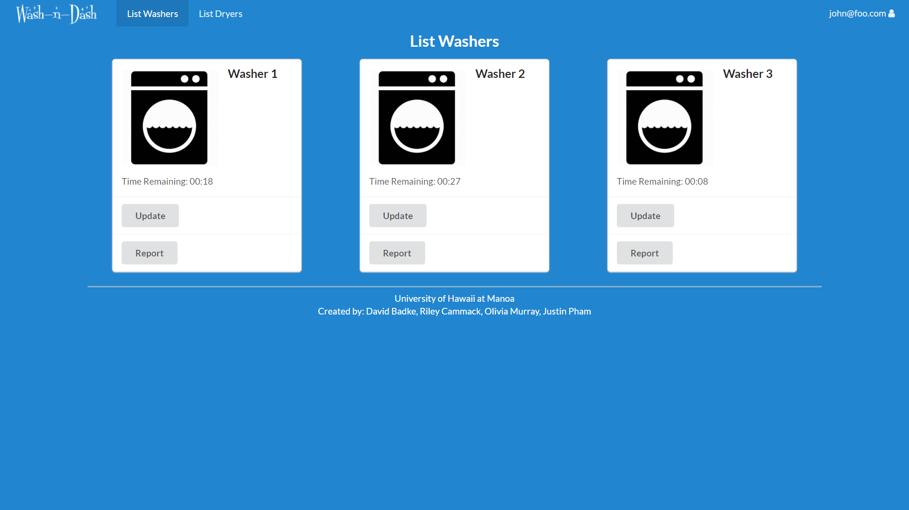
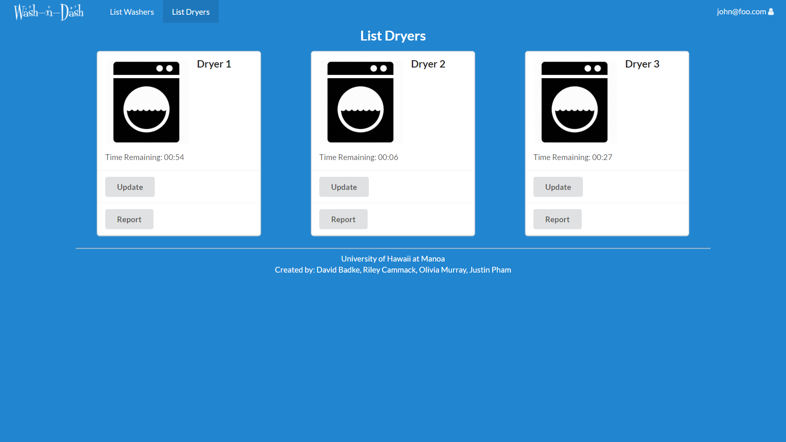

# Table of contents

* [Overview](#about-wash-n-dash)
* [Installation](#installation-instructions)
* [Application Design](#application-design)
  * [Directory Structure](#directory-structure)
* [Development History](#development-history)
  * [Milestone 0: Initial Idea](#milestone-0-initial-idea)
  * [Milestone 1: Mockup and Data Model Development](#milestone-1-mockup-and-data-model-development)
  * [Milestone 2: Administration](#milestone-2-administration)
  * [Milestone 3: Raspberry Pi](#milestone-3-raspberry-pi-appliance-monitor)
* [Initial User Study](#initial-user-study)
* [Contact Us](#contact-us)


# About Wash-N-Dash
The problem: UH students often waste too much time walking down with a full basket of laundry just to find all the washing machines are in use.  

Our web application will provide a reliable way for UH students to track and update the status of the usage of washers/dryers in their dorm's laundry room. This way, students won’t have to walk down and be disappointed when no washing machines are available. The minimal version of this app requires a student to manually use the app to indicate the status of the washers when they are in the room. In the future the application may utilize a raspberry pi appliance monitor to automatically update the status of each machine’s availability on the website. This status will be displayed in the app with a timestamp, so that students accessing the app from their room can assess the reliability of the information. An admin user will have the additional capability to override the displayed status of the machines including showing if a washing machine/dryer is broken. This application is uniquely designed to reflect the status of UH Manoa laundry room(s).  

[You can view the deployed app here](http://washndash.meteorapp.com/#/)

### System Walkthough
Our web application currently performs as follows: 

When you come to [the deployed app](http://washndash.meteorapp.com/#/), you are taken to the following landing page where you can read a description about the application and view the number of available washers and dryers. 

[](http://washndash.meteorapp.com/#/)

From the landing page, you can click the login dropdown in the menu bar. You can then either select to sign in to your account...

[](http://washndash.meteorapp.com/#/signin)

...or sign up for a new account.  

[](http://washndash.meteorapp.com/#/signup)

Once logged in, you can view the available washers/dryers on the following machines page. On this page, you can filter the machine cards by location or by machine type using the two multiple-selection search dropdowns. 

[](http://washndash.meteorapp.com/#/machines)

You can click the update button on any machine card to add 15 minutes to the time remaining field or you can click the report button which brings up a modal. In the modal you can add a timestamped report and view all past reports for that machine. 

[](http://washndash.meteorapp.com/#/machines)

If you log in as a user with the role of administration, one of the additional pages available, the admin page, shows the table of machines with their corresponding number, machine type, location, and time remaining status.  You are also able to toggle between enabled/disabled for each machine.  

[](http://washndash.meteorapp.com/#/admin)

When you click on the "add machine" button, another row is added to the table with default editable data. 

[](http://washndash.meteorapp.com/#/admin)

The other additional page visible for only admin users is the report page. The table lists all of the reports and their corresponding machine numbers. You can manage the reports here by choosing to delete a report which asks for a confirmation before actually removing it. 

[](http://washndash.meteorapp.com/#/reports)

[](http://washndash.meteorapp.com/#/reports)


# Installation Instructions
How to download, install, and deploy the system:
* [install Meteor](https://www.meteor.com/install).

* [download a copy of Wash-N-Dash](https://github.com/wash-n-dash), or clone it using git.
  
* cd into the app/ directory and install libraries with:

 ```
 $ meteor npm install
 ```

* run the system with:

 ```
 $ meteor npm run start
 ```
 
If all goes well, the application will appear at [http://localhost:3000](http://localhost:3000). If you have an account on the UH test CAS server, you can login. 

# Application Design

### Directory Structure
The top-level directory structure contains:

```
app/        # holds the Meteor application sources
config/     # holds configuration files, such as settings.development.json
.gitignore  # don't commit IntelliJ project files, node_modules, and settings.production.json
```

This structure separates configuration files (such as the settings files) in the config/ directory from the actual Meteor application in the app/ directory.

The app/ directory has this top-level structure:

```
client/
  style.css     
  main.html      
  main.js        # import all the client-side html and js files. 

imports/
  api/           
    machine/
  startup/       # Define code to run when system starts up (client-only, server-only)
    both/
    client/        
    server/        
  ui/
    components/  # templates that appear inside a page template.
    layouts/     # Layouts contain common elements to all pages (i.e. menubar and footer)
    pages/       # Pages are navigated to by FlowRouter routes.

node_modules/    # managed by Meteor

private/
  database/      # holds the JSON file used to initialize the database on startup.

public/          
  images/        # holds static images for landing page and predefined sample users.
  
server/
   main.js       # import all the server-side js files.
```


# Development History

### Milestone 0: Initial Idea
Before editing any code for this project, we created the following designs for the mockup pages: 

Landing Page


Login Page


Signup Page


Washing Usage Page


Dryer Usage Page


Admin Page


### Milestone 1: Mockup and Data Model Development
This milestone started on 4/2/18 and ended on 4/12/18

The goals of Milestone 1 included the following: 
* Create a set of HTML pages providing a mockup of the pages in the system
* Implement the data model which is the underlying set of Mongo Collections and the operations upon them that would support our application

Milestone 1 was implemented as [Wash-N-Dash GitHub Milestone M1](https://github.com/wash-n-dash/wash-n-dash/milestone/1) and consisted of 8 issues. Progress was managed via the [Wash-N-Dash GitHub Project M1](https://github.com/wash-n-dash/wash-n-dash/projects/1). 

The following pages were implemented during M1:

Landing Page


Signin Page


Signup Page


Washer Usage Page



Dryer Usage Page




### Milestone 2: Administration
This milestone started on 4/12/18 and ended on 4/24/18

The goals of Milestone 2 included the following:
* Edit washer/dryer pages to be interactive
* Connect the user interface to the underlying data model
* Create an administrator role in the system to manage the machines

Milestone 2 was implemented as [Wash-N-Dash GitHub Milestone M2](https://github.com/wash-n-dash/wash-n-dash/milestone/2) and consisted of 10 issues. Progress was managed via the [Wash-N-Dash GitHub Project M2](https://github.com/wash-n-dash/wash-n-dash/projects/2). 

The following additional/edited pages were implemented during M2:

Landing Page


Available Machines Page (which replaced Washer/Dryer Usage Pages) and report modal


Admin Page


Admin Report Page and confirmation modal


### Milestone 3: Raspberry Pi Appliance Monitor
This milestone starts on 4/24/18 and ends on 5/4/18

The goals of Milestone 3 include the following:
* Set up authentication using the University of Hawaii test CAS system
* Applying a raspberry pi appliance monitor (using an accelerometer) in order to more accurately reflect the usage of the washing machines/dryers in the laundry room(s)

Milestone 3 was implemented as [Wash-N-Dash GitHub Milestone M3](https://github.com/wash-n-dash/wash-n-dash/milestone/3) and consisted of # issues. Progress was managed via the [Wash-N-Dash GitHub Project M3](https://github.com/wash-n-dash/wash-n-dash/projects/3). 


# Initial User Study
Provide a section called “Initial User Study”. This section should describe who you recruited to look at your site, how you conducted the study, and a summary of the feedback you obtained from them

We received the following community feedback where we asked 5 anonymous people to tell us how we can improve our application. Here are some of the responses:
* add a reservation feature for machines (to show intended use)
* have the description on the landing page be clickable
* have a list view for the machines in addition to the card view
* make it more obvious if a washer is in use (maybe an icon on the cards)
* show the washer and dryer counts together on the landing page
* move the washer and dryer counts more towards the top of the landing page
* capitalize the machine type


# Contact Us
* [Riley Cammack](https://rcammack.github.io/) (CENG): rcammack@hawaii.edu
  * loves ice cream and playing catan
* [Justin Pham](https://jpham79.github.io/) (CS): jpham79@hawaii.edu
  * Student by day, gamer by night
* [Olivia Murray](https://olivia-murray.github.io/) (CS): omurray4@hawaii.edu
  * 
* David Badke (CS): @hawaii.edu
  * 
